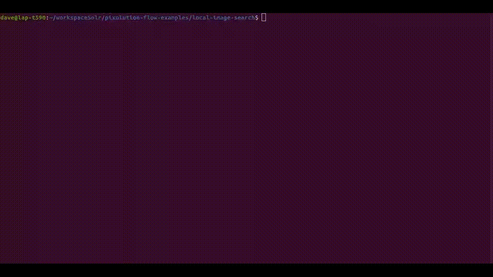

# Examples for pixolution Flow
pixolution Flow is a high performance image search server. Under the hood, it extends the open-source search platform [Apache Solr™](https://solr.apache.org/).

This repo contains example scripts that show use cases and serve as a basis for your own developments.

### Next Steps
Some useful resources to get more insights.
 * [Pixolution](https://pixolution.org) - company website
 * [Go Pro](https://pixolution.org/pricing) - Pricing and AI services
 * [Visual Search API](https://docs.pixolution.org) - API params related to visual image searches
 * [Apache Solr Reference Guide](https://solr.apache.org/guide/8_8/) - all other parameter (e.g. textual)

## Installation

You have a working Python 3.8+ environment and a installation of [Docker](https://docs.docker.com/get-docker/).

We use the free version of pixolution Flow so you can start right away (no registration). You can index up to 5000 images. If you exceed the limit pixolution Flow rejects adding more images. You can then upgrade to the [Professional Plan](https://pixolution.org/pricing).

### Docker
Download and start the pixolution Flow image:

```bash
docker pull pixolution/flow
docker run --rm -p8983:8983 pixolution/flow
```


### Python
We assume you already have cloned this Git repo. We recommend creating a new Python virtual environment to have a clean installation of the examples and prevent dependency conflicts.
```bash
python3 -m venv flow-examples/venv
```
Go to project root and activate the virtual environment
```bash
cd flow-examples
source venv/bin/activate
```
Upgrade pip and install the python dependencies
```bash
pip3 install --upgrade pip
pip3 install -r requirements.txt
```

The [Pillow](https://pypi.org/project/Pillow/) python library may require the jpeg development header installed on the host system. For example in Debian/Ubuntu you may need to install:
```
apt install libjpeg-dev zlib1g-dev
```

That's it! Now, choose an example your would like to test.


## Choose an example

### [Build a local image search server 	&#10142;](local-image-search/README.md)
Index your local images into pixolution Flow and search for similar images with a shiny HTML search interface.



### [Dive into example API calls	&#10142;](example-api-calls/README.md)
Plain HTTP API calls without boilerplate code.
