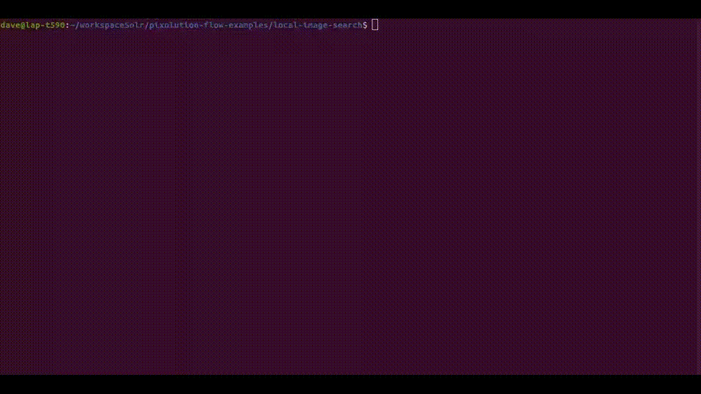
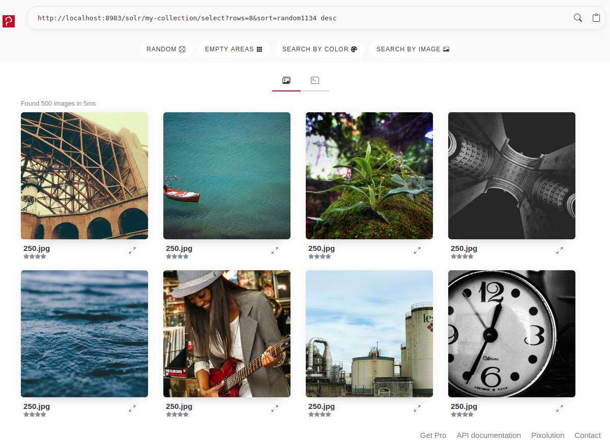
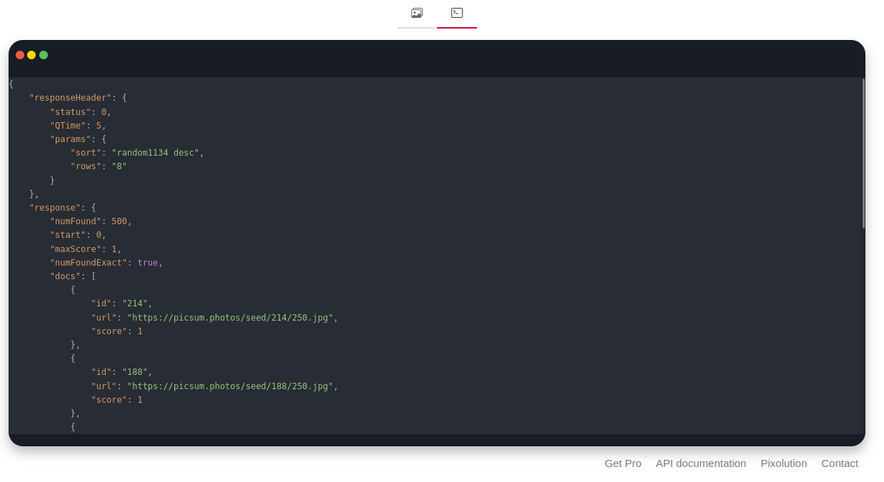

# Local Image Search Engine



## Overview


| | |
| ------------- | ------------- |
| **Goal** | Learn how to index your local images and create a local image search  engine to find the most similar images to a query image. |
| **Data Collection** | Local Images from scanning a given folder tree or web images if you do not have local images |
| **Search Input** | An image |
| **Showcases** | Visual Similarity Search |

This example ships with a frontend search interface written in plain HTML + JS.


### Requirements
Follow the steps described in the [README.md](../README.md) in project root.


## Index images
The script automatically indexes 500 web images from [picsum.photos](https://picsum.photos) when called without parameters:

```bash
python3 add_images.py
```

OR provide a local directory path:

```bash
python3 add_images.py /path/to/your/local/images
```
The script then collects all `.jpg`, `.png` and `.gif` image files within the given folder and index them.
Depending on your hardware and the number of images the indexing process may take some time.

## Open Frontend

You can either open the `ui/index.html` by starting your browser

```bash
chromium ui/index.html
firefox ui/index.html
```
or simply paste the absolute file path of `ui/index.html` in your browser.



The UI ships with great **search presets** which help you to understand the query syntax and search functions of pixolution Flow.
 * `RANDOM`: Show random images to easily explore your image collection
 * `EMPTY AREAS`: Show random images with areas suitable to add text or logos ([API docs](https://docs.pixolution.org/#/text-space-filter))
 * `SEARCH BY COLOR`: Search images similar to a random color ([API docs](https://docs.pixolution.org/#/visual-search?id=search-by-color))
 * `SEARCH BY IMAGE`: Pick a random image from the image collection and search for similar ones ([API docs](https://docs.pixolution.org/#/visual-search?id=search-by-image))

Start exploring your image collection by using the search presets or manually add search params into the search bar.

You can toggle whether to display the raw JSON response or the shiny HTML image list.


